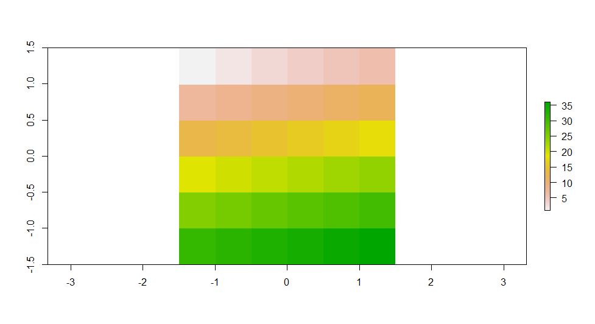

```{r, include = FALSE}
library(tinytex)
library(dplyr)
library(tidyr)
library(raster)
library(sf)
library(sp)
library(ggplot2)
library(lattice)
library(leaflet)
library(osmdata)
library(tmap)
library(here)
library(rasterVis)
library(viridis)

```

*****

```{r xaringan, fig.margin = TRUE, echo = FALSE, fig.width=4, fig.height=8, fig.cap = "Xaringan Slide"}
knitr::include_graphics("img/xaringan.png")
```


# Xaringan

- Ermöglicht es mit  RMarkdown-Syntax Präsentationen zu erstellen
- Basiert auf dem JavaScript-Tool `remark.js` 
- RStudio addin "Infinite Moon Reader" erstellt Live-Updates bei Änderungen im RMarkdown-Dokuement

```yaml
---
title: "A  Presentation"
output:
  xaringan::moon_reader:
---
```

```{r echo = FALSE, fig.margin = TRUE, fig.cap = " "}

```

```{r echo = FALSE, fig.margin = TRUE, fig.cap = "Quelle: zensus2011.de"}

```


# Der Zensus und seine Daten


- Europaweite Volkszählung in 2011 (nächste in 2021)
- Daten zu Bevölkerung, Erwerbstätigkeit, Gebäude- und Wohnungsbestand 
- Registergestütztes Verfahren
- Gittenzellenbasierte Ergebnisse entweder im 100m-Gitter oder 1km-Gitter

# Das `raster`-package

```{r echo=FALSE, fig.margin = TRUE, fig.height=4, fig.width=6}

```


- Entwickelt von Robert Hijman in 2010 (das `sp`-paket wurde 2005 veröffentlicht)
- `RasterLayer`, `RasterBrick` und `RasterStack` sind die zentralen Objekte

*****

```{r, }
# Raster selbst erstellen
test = raster(nrows = 6, ncols = 6, res = 0.5, 
              xmn = -1.5, xmx = 1.5, ymn = -1.5,
              ymx = 1.5, vals = 1:36)
```

*****


# Beispiel mit Zensusdaten aus 2011

- Zunächst wird das `.csv'-file eingelsen
- Selektion wichtigen Variablen. Wichtig: *X* und *Y* müssen in der 1. bzw. 2. Spalte stehen
- Anschließend werden die fehlenden Werte mir `NA` kodiert
- Zu letzt wird der `data.frame` mittels der Funktion `rasterFromXYZ` in einen `RasterBrick` konvertiert

*****

```{r}
census = read.csv("../data/raster/census/Zensus_klassierte_Werte_1km-Gitter.csv",
                  sep = ";")

census_new = dplyr::select(census, x = x_mp_1km, y = y_mp_1km, Einwohner,
                      fr_a = Frauen_A, alt_d = Alter_D,
                      hh_gr = HHGroesse_D, u_18 = unter18_A, ue65 = ab65_A,
                      ausl = Auslaender_A, leer = Leerstandsquote)

census_clean = dplyr::mutate_all(census_new, ~ifelse(. %in% c(-1, -9), NA, .))

rast_brick = rasterFromXYZ(census_clean, crs = st_crs(3035)$proj4string)


```
*****

- Als Nächstes wird das Objekt der Klasse `Rasterbrick` zu einem Objekt der Klasse`RasterStack` kovertiert
- Außerdem wird es auf den Extent des `sf`-objektes `ham_crop` zugeschnitten und dann mit `ham_mask` maskiert

*****
```{r, include=FALSE}
hamburg= st_read("../data/shape/hamburg.shp")

hamburg = st_transform(hamburg, 3035)
st_crs(hamburg)
```

```{r}
# Von RasterBrick zu RasterStack
ger_stack = raster::stack(rast_brick)

# Crop und Mask von RasterStack
ham_crop = crop(x = ger_stack, y = extent(hamburg))
ham_mask = mask(ham_crop, hamburg)
```

*****

- Nun werden alle Layer in dem `RasterStack` geplottet

```{r, echo=FALSE}
plot(ham_mask)
```


- Um nur zwei Layer

# References

