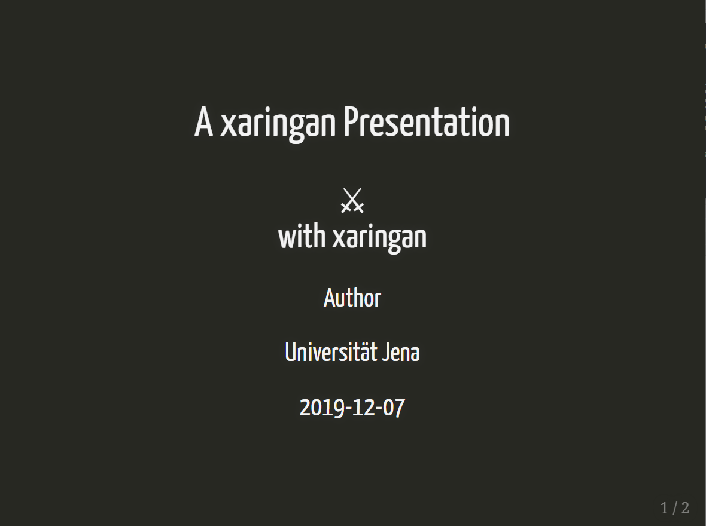

```{r setup, include=FALSE}
library(tufte)
# invalidate cache when the tufte version changes
knitr::opts_chunk$set(tidy = FALSE, cache.extra = packageVersion('tufte'))
options(htmltools.dir.version = FALSE)
```

# Xaringan

```{r echo = FALSE, fig.height=1,  fig.margin = TRUE, fig.cap = " "}

```

- Ermöglicht es mit  RMarkdown-Syntax Präsentationen zu erstellen
- Basiert auf dem JavaScript-tool `remark.js` 
- RStudio addin "Infinite Moon Reader" erstellt Live-Updates bei Änderungen im RMarkdown-Dokuement

```yaml
---
title: "A  Presentation"
output:
  xaringan::moon_reader:
    yolo: true
---
```


```{r}
library(raster)
x = raster(ncol=36, nrow=18, xmn=-1000, xmx=1000, ymn=-100, ymx=900)
res(x) <- 100
projection(x) <- "+proj=utm +zone=48 +datum=WGS84" 

```

