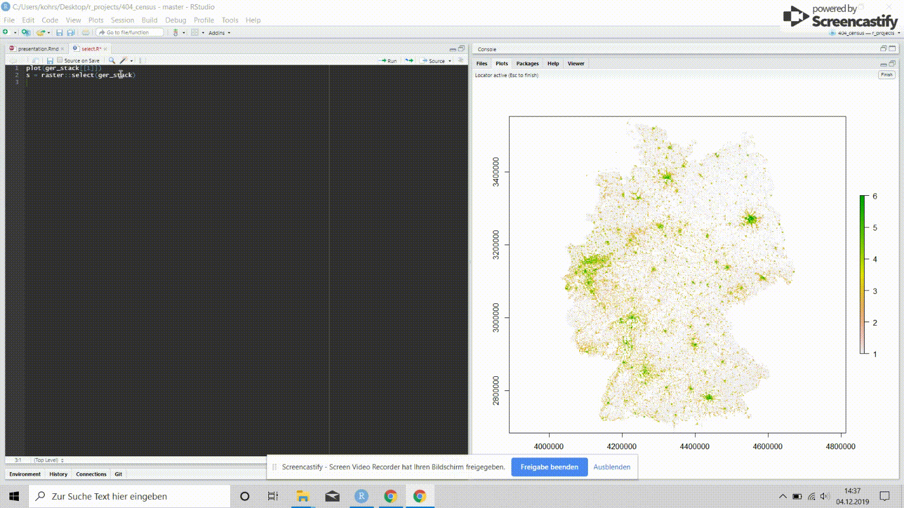
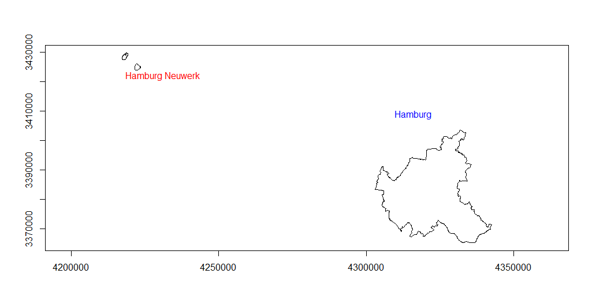
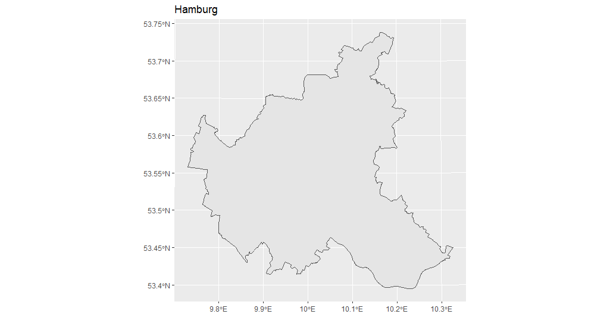
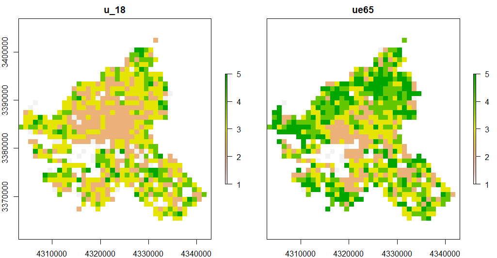
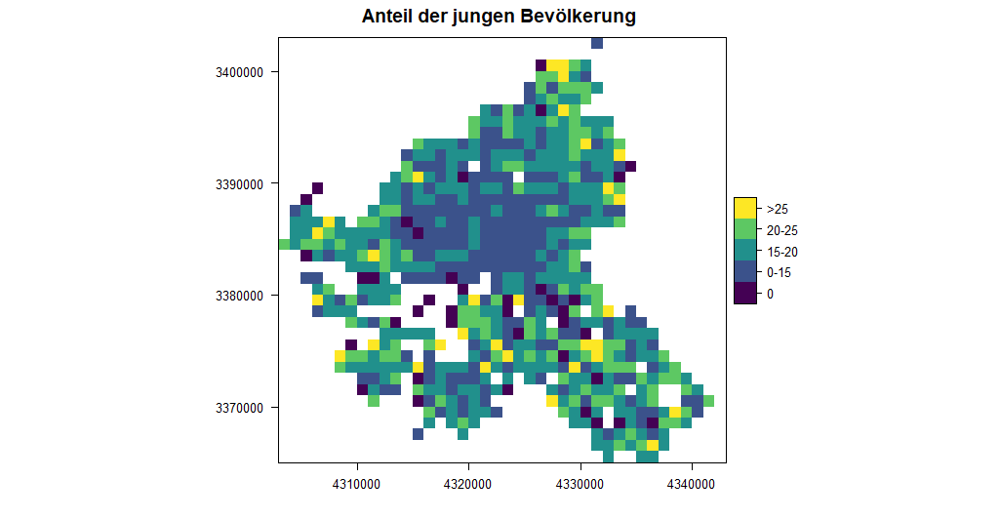
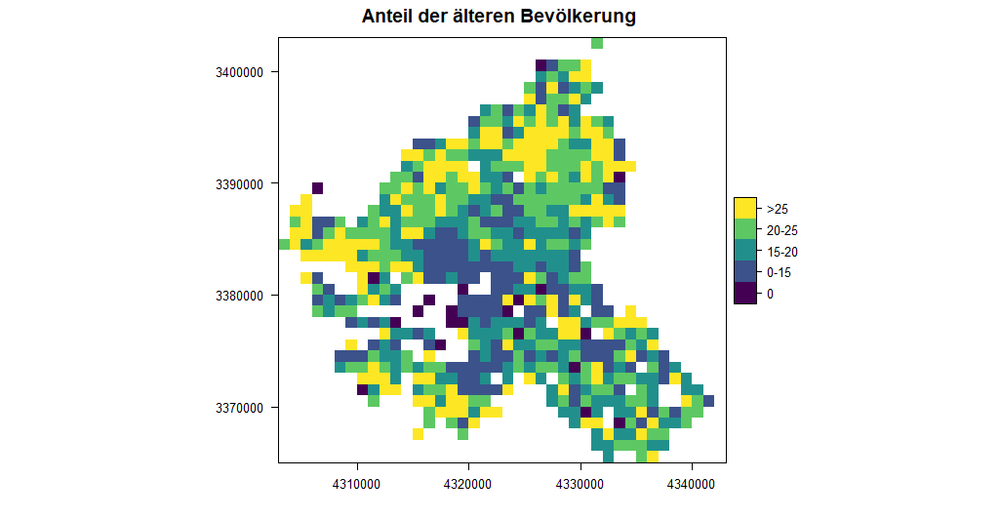

layout: true
  
<div class="my-header"><span>28.11.2020 - Deutsche Zensus Daten im RasterStack in R </span></div>

<div class="my-footer"><span>404</span></div> 

---

# Struktur der Präsentation

```{r libs, include=FALSE}
library(dplyr)
library(tidyr)
library(raster)
library(sf)
library(sp)
library(ggplot2)
library(lattice)
library(leaflet)
library(osmdata)
library(tmap)
library(here)
library(rasterVis)
library(viridis)
```


--

Was ist Xaringan?

Was ist ein `RasterStack`?

Was ist der Zensus?

Wie sieht die Datenlage aus?

Anwendungsbeispiel

---

# Was ist Xaringan ?
 
- xaringan-package von Xie (2019) <sup>1</sup>

- "An R package for creating HTML5 presentations with remark.js through R Markdown." <sup>2</sup>

- remark.js benutzt nicht Pandoc, sondern rendert Markdown in *real time* im Browser

- große stilistische Freiheiten (wenn man CSS kann)

- Xaringan generiert keine *Self-Contained* Präsentationen 

- `Infitnite Moon Reader` RStudio Add In
.footnote[
[1] [xie 2019](https://CRAN.R-project.org/package=xaringan) <br>
[2] [https://arm.rbind.io/slides/xaringan.html#17](https://arm.rbind.io/slides/xaringan.html#17)
]

---

background-image: url(https://user-images.githubusercontent.com/163582/53144527-35f7a500-3562-11e9-862e-892d3fd7036d.gif)
background-position: 50% 60%
background-size: 80%

## How to Build Presentations in RStuido with xaringan


.footnote[

Source: [Xie, Y. (2019). The Ultimate Infinite Moon Reader for xaringan Slides](https://yihui.name/en/2019/02/ultimate-inf-mr/)

]


---

# Was ist der Zensus?


---

class: center, middle, upper

# Was ist ein `RasterStack` ?

>  "RasterStack is a list of RasterLayer objects with the same extent and resolution" <sup>1</sup>

.footnote[
[1] [Lovelace et al. 2018 S: ]()
]
  
---

# Wo bekommen man die Daten her?

100m
```{r, eval = FALSE}
# Link for data at 1km resolution
url_1km = "https://www.zensus2011.de/SharedDocs/Downloads/DE/Pressemitteilung/DemografischeGrunddaten/csv_Zensusatlas_klassierte_Werte_1km_Gitter.zip;jsessionid=1C3BBC82F13D65F0DC4689BA428846F4.1_cid380?__blob=publicationFile&v=8"
```

oder

1km 
```{r eval = FALSE}
url_100m = "https://www.zensus2011.de/SharedDocs/Downloads/DE/Pressemitteilung/DemografischeGrunddaten/csv_Bevoelkerung_100m_Gitter.zip?__blob=publicationFile&v=3"
```


---

```{r}
census = read.csv("../data/raster/census/Zensus_klassierte_Werte_1km-Gitter.csv", sep = ";")
str(census)
```


- Was sind das für Werte bei *x_mp_1km* und *y_mp_1km* ?

- Warum so viele `-1`

- Frauen_A ?

- ...

---

# Beschreibung des Datensatz


---

# Vorprozessierung der Daten

- Kodierung und Auswahl der Variablen

```{r select}
# Umbenennen der Variablen
# X undd Y in erste beiden Spalten
census_new = dplyr::select(census, x = x_mp_1km, y = y_mp_1km, Einwohner,
                      fr_a = Frauen_A, alt_d = Alter_D,
                      hh_gr = HHGroesse_D, u_18 = unter18_A, ue65 = ab65_A,
                      ausl = Auslaender_A, leer = Leerstandsquote)

```

--

- Fehlende Daten richtig in R codieren

```{r mutate}
# Encode all NAs
census_clean = dplyr::mutate_all(census_new, ~ifelse(. %in% c(-1, -9), NA, .))
```

---

## Von .csv zu RasterStack

```{r}
names(st_crs(3035))
```

```{r}
# make it a RasterBrick
rast_brick = rasterFromXYZ(census_clean, crs = st_crs(3035)$proj4string)
```

```{r}
class(rast_brick)
```
---

```{r}
# Write Raster
writeRaster(rast_brick, "../data/raster/tif/gridcell1km.grd", mode = "wb", overwrite = T, format = "raster")

# Read RasterStack
ger_stack = stack("../data/raster/tif/gridcell1km.grd")
```


```{r}
class(ger_stack)
```
---


```{r}
for (i in names(ger_stack)) {
  ger_stack[[i]] = ratify(ger_stack[[i]])
  values(ger_stack[[i]]) = as.factor(values(ger_stack[[i]]))
}
```

```{r}
ger_stack
```
```{r nlayers}
nlayers(ger_stack)
res(ger_stack)
```


---

## RasterStack und RasterBrick <sub>1</sub>
 
- `RasterBrick` kann nur eine (multilyer-) Datei als Quelle haben 

- `RasterStack` kann aus verschiedenen Datein (Layern) zusammengestellt werden.
  > a RasterStack is a list of RasterLayer objects with the same extent and resolution <sub>2</sub>

- Funtionen, die mit `RasterStack` und `RasterBrick` arbeiten können, geben normalerweise einen `RasterBrick` zurück

.footnote[
[1] [Hijmans, 2019](https://rspatial.org/raster/spatial/4-rasterdata.html)
[2] [Lovelace, 2019: S:](https://geocompr.robinlovelace.net/spatial-class.html#raster-data)
]

---

```{r plot}
plot(ger_stack[["Einwohner"]])
```


---

# Interaktives Croppen




---


# Croppen und Masken mittels eines Shapefiles

```{r results='hide'}
ger_wgs = st_read("../data/shape/ger_utm_wgs84/VG250_Bundeslaender.shp")
ger_3035 = st_transform(ger_wgs, 3035)
hamburg = ger_3035 %>% dplyr::filter(GEN == "Hamburg")
```




---

# Crop-Feature

```{r, include=FALSE}
hamburg_crop_sf = st_read("../data/shape/hamburg.shp")
hamburg_crop_sp= as(hamburg_crop_sf, Class = "Spatial")

```



---

```{r, echo=FALSE}
pal=viridis(5)

einwohner = raster::subset(ger_stack, "Einwohner")

hamburg_wgs = st_transform(hamburg_crop_sf, 4326)


leaflet() %>%
  setView(10, 53.6, zoom = 9) %>% 
  addProviderTiles('Stamen.Terrain',group='Stamen Terrain') %>%
  addRasterImage(einwohner , colors = pal, opacity = 0.6, group = "Einwohner") %>%
  addPolygons(data = hamburg_wgs, group = "Hamburg", color = "red") %>% 
  addLayersControl(
    baseGroups = c("Stamen Terrain"),
    overlayGroups = c("Einwohner", "Hamburg"),
    options = layersControlOptions(collapsed = FALSE)) %>% 
   hideGroup(c("Einwohner")) 
  
  
```

---

# Modyfying a raster in R: Crop und Mask <sub>1</sub>

-- 

- `crop()`: erstellt Subset von einem `raster`-Object auf der Basis des `extent` eines `raster*`, `sf` oder `sp`-objekt

--

- `mask()`: verwirft alle Zellen in einem `Raster*`-Objekt, die `NA` in einem anderen sind. 

.footnote[
[1][Hijmans, R J (2019)](https://rspatial.org/raster/spatial/8-rastermanip.html)
]
---

```{r, echo=FALSE}
ham_crop = crop(x = ger_stack, y = extent(hamburg_crop_sf))
ham_mask = mask(ham_crop, hamburg_crop_sf)
plot(ham_mask)
```


---

```{r, include = FALSE}
layers = c("u_18", "ue65")
ind = which(names(ham_mask) == layers)
alter = raster::subset(ham_mask, ind)
alt = raster::subset(ham_mask, "ue65")
jung = raster::subset(ham_mask, "u_18")
```

```{r}

```


---

# RAT

```{r}
# add percentage to rat of alt
levels(alt)[[1]] = cbind(levels(alter)[[1]], percentage = c("0", "0-15", "15-20", "20-25", ">25"))

# add percentage to rat of jung
levels(jung)[[1]] = cbind(levels(alter)[[1]], percentage = c("0", "0-15", "15-20", "20-25", ">25"))

```


> "a RasterLayer is linked to other values via a "Raster Attribute Table" (RAT). Thus the cell values are an index, whereas the **actual values of interest** are in the RAT. The RAT is a data.frame." <sub>1</sub>

.footnote[
[1][Hijmans, R J](https://cran.r-project.org/web/packages/raster/raster.pdf)
]

---

```{r echo = FALSE}

```
---

```{r, echo = FALSE}

```


---
# Leaflet

```{r, echo=FALSE}
pal=viridis(5)


leaflet() %>%
  addProviderTiles('Esri.WorldImagery',group='Imagery') %>%
  addProviderTiles('Esri.WorldStreetMap', group='Streets') %>%
  addRasterImage(alt, colors = pal, opacity = 0.7, group = "alt") %>%
  addRasterImage(jung, colors = pal, opacity = 0.7, group = "jung") %>%
  addLayersControl(
    baseGroups = c("Imagery", "Streets"),
    overlayGroups = c("alt", "jung"),
    options = layersControlOptions(collapsed = FALSE)
  ) %>%
  hideGroup(c("alt", "jung")) %>% 
  addLegend(colors = pal, labels = levels(alt)[[1]]$percentage)
```

# Mapview 

```{r, echo=FALSE}
library(mapview)
mapview(alt, col.regions = pal) + mapview(jung, col.regions = pal) + mapview(hamburg)
```

---

```{r, echo = FALSE, message=FALSE, warning=FALSE}
library(leafsync)
m1 = mapview(alt)
m2 = mapview(jung)

leafsync::sync(m1,m2)

```


---
# Use the 100m grid-cell resolution data

```{r, include=FALSE}
# Read in 100m grid-cell raster
ger_100m = raster("../data/raster/tif/gridcell_100m.tif")
object.size(ger_100m)
file.size("../data/raster/tif/gridcell_100m.tif")
```


```{r, include=FALSE}
ham_crop = crop(x = ger_100m, y = extent(hamburg_crop_sp))
ham_mask_100m = mask(ham_crop, hamburg_crop_sf)
```

```{r, echo=FALSE}
mapview(ham_mask_100m)
```

---

```{r, echo=FALSE, message=FALSE, warning=FALSE}
# get values from single RasterLayer
vals = values(ham_mask_100m)


# get 5 highest values 
val_cells = values(ham_mask_100m)
top_5 = tail(sort(val_cells), 5)

# make point df
outlier = data.frame( x = top_5, y = rep(0, 5))

 g = ggplot() +
  geom_histogram(aes(vals)) +
  xlab("Einwohner pro 100m x 100m Gitterzelle") +
  ylab("Anzahl an Zellen") +
  ggtitle("Histogram of Raster") +
  theme_minimal()
 
 g + geom_point(data = outlier, mapping = aes(x =x, y = y, color = factor(x))) +
   theme(legend.title = element_text()) +
   scale_colour_discrete(name = "Outlier")
   
```

---

```{r,echo=FALSE}
# Set all Values over 600 to NA
cell_vals = values(ham_mask_100m)
cell_vals[cell_vals > 600] = NA
values(ham_mask_100m) = cell_vals

mapview(ham_mask_100m, layer.name = "Einwohner in Hamburg")

```


---

# ggplot2 for Raster plotting

```{r, echo=FALSE}
# Convert Raster to dataframe in order to plot withh ggplot
ham_df <- as.data.frame(ham_mask_100m, xy = TRUE)

ggplot() +
    geom_raster(data = ham_df , aes(x = x, y = y, fill = gridcell_100m)) +
    scale_fill_viridis_c() +
    coord_quickmap()
```

---

# Tmap 

## Quick tmap `qtm()`

```{r}

names(ham_mask)

tmap_mode("view")

tmap::qtm(ham_mask[["hh_gr"]])


```


---


```{r}
ham_stack = raster::stack(ham_mask)
names(ham_stack)
einw = tm_shape(ham_mask[["Einwohner"]]) + tm_raster(title = "Einwohner", palette = pal)
fr_a = tm_shape(ham_mask[["fr_a"]]) + tm_raster(title = "Frauenanteil", palette = pal)
alt_d = tm_shape(ham_mask[["alt_d"]]) + tm_raster(title = "Altersdurchschnitt", palette = pal)
hh_gr = tm_shape(ham_mask[["hh_gr"]]) + tm_raster(title = "Haushaltsgroesse", palette = pal)


einw + fra + alt + gr + tm_layout(title = "Map with 8 Layers from the Census")


```
---


```{r}


# Create New RasterLayer
einwohner = raster::subset(ham_mask, "Einwohner")
frauenanteil = raster::subset(ham_mask, "fr_a")
altersdurchschnitt = raster::subset(ham_mask, "alt_d")
haushaltsgroesse = raster::subset(ham_mask, "hh_gr")
unter_18 = raster::subset(ham_mask, "u_18")
ueber_65 = raster::subset(ham_mask, "ue65")
auslaender = raster::subset(ham_mask, "ausl")
leerstand = raster::subset(ham_mask, "leer")


# create new einw RasterLayer RAT
levels(einwohner)[[1]] = cbind(levels(einwohner)[[1]], Anteil = c("3-250", "250-500", "500-2000", "2000-4000", "4000-8000", ">8000"))
levels(einwohner) = subset(levels(einwohner)[[1]], select = c(1,3))


# Create new frauenanteil RAT-Column
levels(frauenanteil)[[1]] = cbind(levels(frauenanteil)[[1]], Anteil = c("0-40", "40-47", "47-53", "53-60", ">60"))
levels(frauenanteil) = subset(levels(frauenanteil)[[1]], select = c(1,3))

# Create new altersdurchschnitt RAT Column
levels(altersdurchschnitt)[[1]] = cbind(levels(altersdurchschnitt)[[1]], Anteil = c("0-40", "0-42", "42-44", "44-47", ">47"))
levels(altersdurchschnitt) = subset(levels(altersdurchschnitt)[[1]], select = c(1,3))

# create new haushaltsgröße RAT-COlumn
levels(haushaltsgroesse)[[1]] = cbind(levels(haushaltsgroesse)[[1]], Anteil = c("1-2", "2-2.5", "2.5-3", "3-3.5", ">3.5"))
levels(haushaltsgroesse)[[1]] = subset(levels(haushaltsgroesse)[[1]], select = c(1,3))

# create new unter_10 RAT-Column
levels(unter_18)[[1]] = cbind(levels(unter_18)[[1]], Anteil = c("0", "0-15", "15-20", "20-25", ">25"))
levels(unter_18) = subset(levels(unter_18)[[1]], select = c(1,3))

# create new ueber_65 RAT-Column 
levels(ueber_65)[[1]] = cbind(levels(ueber_65)[[1]], Anteil = c("0", "0-15", "15-20", "20-25", ">25"))
levels(ueber_65) = subset(levels(ueber_65)[[1]], select = c(1,3))

# create new auslaender RAT Columns
levels(auslaender)[[1]] = cbind(levels(auslaender)[[1]], Anteil = c("0", "0-4", "4-8", "8-20", ">20"))
levels(auslaender) = subset(levels(auslaender)[[1]], select = c(1,3))

# create new leerstand RAT column
levels(leerstand)[[1]] = cbind(levels(leerstand)[[1]], Anteil = c("0-1", "1-3", "3-5", "5-10", ">10"))
levels(leerstand) = subset(levels(leerstand)[[1]], select = c(1,3))

```


```{r}


p1 = tm_shape(einwohner) +
  tm_raster(legend.show = TRUE, palette = pal, title = "Einwohner pro 1x1km", group = "einwohner") +
   tm_layout(outer.margins = rep(0.01, 4), 
            inner.margins = rep(0, 4)) +
  tm_legend(bg.color = "white")
  
p2 = tm_shape(frauenanteil) +
  tm_raster(legend.show = TRUE, palette = pal, title = "Frauenanteil pro 1x1km", group = "frauenanteil") +
   tm_layout(outer.margins = rep(0.01, 4), 
            inner.margins = rep(0, 4)) +
  tm_legend(bg.color = "white")

p3 = tm_shape(altersdurchschnitt) +
  tm_raster(legend.show = TRUE, palette = pal, title = "Altersdurchschnitt pro 1x1km", group = "altersdurchschnitt") +
   tm_layout(outer.margins = rep(0.01, 4), 
            inner.margins = rep(0, 4)) +
  tm_legend(bg.color = "white")

p4 = tm_shape(haushaltsgroesse) +
  tm_raster(legend.show = TRUE, palette = pal, title = "Haushaltsgröße pro 1x1km", group = "haushaltsgröße") +
   tm_layout(outer.margins = rep(0.01, 4), 
            inner.margins = rep(0, 4)) +
  tm_legend(bg.color = "white")

p5 = tm_shape(unter_18) +
  tm_raster(legend.show = TRUE, palette = pal, title = "Anteil u18 pro 1x1km", group = "unter 18") +
   tm_layout(outer.margins = rep(0.01, 4), 
            inner.margins = rep(0, 4)) +
  tm_legend(bg.color = "white")

p6 = tm_shape(ueber_65) +
  tm_raster(legend.show = TRUE, palette = pal, title = "Anteil ü65 pro 1x1km", group = "über 65") +
   tm_layout(outer.margins = rep(0.01, 4), 
            inner.margins = rep(0, 4)) +
  tm_legend(bg.color = "white")

p7 = tm_shape(auslaender) +
  tm_raster(legend.show = TRUE, palette = pal, title = "Anteil Ausländer pro 1x1km", group = "ausländer") +
   tm_layout(outer.margins = rep(0.01, 4), 
            inner.margins = rep(0, 4)) +
  tm_legend(bg.color = "white")

p8 = tm_shape(leerstand) +
  tm_raster(legend.show = TRUE, palette = pal, title = "Leerstand pro 1x1km", group = "leerstand") +
   tm_layout(outer.margins = rep(0.01, 4), 
            inner.margins = rep(0, 4)) +
  tm_legend(bg.color = "white")


```


```{r}

tm = p1 +p2 +p3 +p4 +p5 +p6 +p7 +p8 + tm_layout(title = "Map of 8 single Layers with tmap and Leaflet")

tm %>% 
  tmap_leaflet() %>% 
  leaflet::hideGroup(c("frauenanteil", "altersdurchschnitt", "haushaltsgröße", "unter 18", "über 65", "ausländer", "leerstand"))


```


---
# RasterMath

- Overlay
...


---

# References

