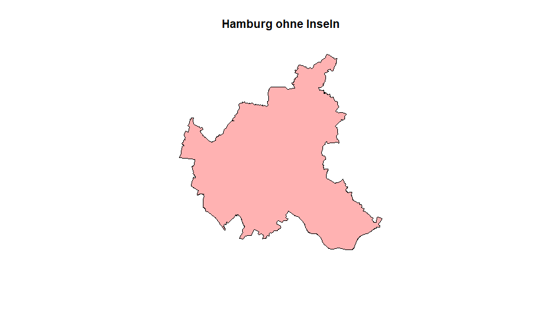

# Struktur der Präsentation

```{r libs, include=FALSE}
library(dplyr)
library(tidyr)
library(raster)
library(sf)
library(sp)
library(ggplot2)
library(lattice)
library(leaflet)
library(osmdata)
library(tmap)
library(here)
library(rasterVis)
library(viridis)
```


--

Was ist Xaringan?

Was ist ein `RasterStack`?

Was ist der Zensus?

Wie sieht die Datenlage aus?

Anwendungsbeispiel

---

# Was ist Xaringan ?
 
- xaringan-package von Xie (2019) <sup>1</sup>

- "An R package for creating HTML5 presentations with remark.js through R Markdown." <sup>2</sup>

- remark.js benutzt nicht Pandoc, sondern rendert Markdown in *real time* im Browser

- große stilistische Freiheiten (wenn man CSS kann)

- Xaringan generiert keine *Self-Contained* Präsentationen 
.footnote[
[1] [xie 2019](https://CRAN.R-project.org/package=xaringan) <br>
[2] [https://arm.rbind.io/slides/xaringan.html#17](https://arm.rbind.io/slides/xaringan.html#17)
]

---

# Was ist der Zensus?


---

class: center, middle, upper

# Was ist ein `RasterStack` ?

>  "RasterStack is a list of RasterLayer objects with the same extent and resolution" <sup>1</sup>

.footnote[
[1] [Lovelace et al. 2018 S: ]()
]
  
---

# Wo bekommen man die Daten her?

```{r, eval = FALSE}
# Link for data at 1km resolution
url = "https://www.zensus2011.de/SharedDocs/Downloads/DE/Pressemitteilung/DemografischeGrunddaten/csv_Zensusatlas_klassierte_Werte_1km_Gitter.zip;jsessionid=1C3BBC82F13D65F0DC4689BA428846F4.1_cid380?__blob=publicationFile&v=8"
```

- 1km vs. 100m ?

---

```{r}
census = read.csv("../data/raster/census/Zensus_klassierte_Werte_1km-Gitter.csv", sep = ";")
str(census)
```


- Was sind das für Werte bei *x_mp_1km* und *y_mp_1km* ?

- Warum so viele `-1`

- ...


---

# Beschreibung des Datensatz


---

# Vorprozessierung der Daten

- Abkürzungen für Variablen

```{r select}
# Umbenennen der Variablen
# X undd Y in erste beiden Spalten
census_new = dplyr::select(census, x = x_mp_1km, y = y_mp_1km, Einwohner,
                      fr_a = Frauen_A, alt_d = Alter_D,
                      hh_gr = HHGroesse_D, u_18 = unter18_A, ue65 = ab65_A,
                      ausl = Auslaender_A, leer = Leerstandsquote)

```

--

- Fehlende Daten richtig in R codieren

```{r mutate}
# Encode all NAs
census_clean = dplyr::mutate_all(census_new, ~ifelse(. %in% c(-1, -9), NA, .))
```

---

## Von .csv zu `raster.stack` ?

```{r}
# make it a RasterBrick
rast_brick = rasterFromXYZ(census_clean, crs = st_crs(3035)$proj4string)
```


```{r}
writeRaster(rast_brick, "../data/raster/tif/gridcell1km.grd", mode = "wb", overwrite = T, format = "raster")

ger_stack = stack("../data/raster/tif/gridcell1km.grd")
```


```{r}
class(ger_stack)
```
---

```{r}
for (i in names(ger_stack)) {
  ger_stack[[i]] = ratify(ger_stack[[i]])
  values(ger_stack[[i]]) = as.factor(values(ger_stack[[i]]))
}
```

```{r}
ger_stack
```


---

## `RasterStack` und `RasterBrick` ? <sub>1</sub>
 
- `RasterBrick` kann nur eine (multilyer-) Datei als Quelle haben 
- `RasterStack` kann aus verschiedenen Datein (Layern) zusammengestellt werden
- Funtionen, die mit `RasterStack` und `RasterBrick` arbeiten können, geben normalerweise einen `RasterBrick` zurück

.footnote[
[1] [Hijmans, 2019](https://rspatial.org/raster/spatial/4-rasterdata.html)
]

---


## Interaktives croppen eines rasters
`
s = raster::select(ger_stack)
`

---

# Croppen und Masken mittels eines Shapefiles

```{r results='hide'}
ger_wgs = st_read("../data/shape/ger_utm_wgs84/VG250_Bundeslaender.shp")
ger_3035 = st_transform(ger_wgs, 3035)
hamburg = ger_3035 %>% dplyr::filter(GEN == "Hamburg")
```


---

# Crop the shapefile

```{r, include=FALSE}
hamburg_crop_sf = st_read("../data/shape/hamburg.shp")
hamburg_crop_sp= as(hamburg_crop_sf, Class = "Spatial")

```



---

```{r, include=FALSE}
ham_crop = crop(x = ger_stack, y = extent(hamburg_crop_sp))
ham_mask = mask(ham_crop, hamburg_crop_sf)

plot(ham_mask)
```


---

```{r, include = FALSE}
layers = c("u_18", "ue65")
ind = which(names(ham_mask) == layers)
alter = raster::subset(ham_mask, ind)
alt = raster::subset(ham_mask, "ue65")
jung = raster::subset(ham_mask, "u_18")
```

```{r}
knitr::include_graphics("img/alter_raster.png")
```


---

```{r, include=FALSE}
# add percentage to rat of alt
levels(alt)[[1]] = cbind(levels(alter)[[1]], percentage = c("0", "0-15", "15-20", "20-25", ">25"))

# add percentage to rat of jung
levels(jung)[[1]] = cbind(levels(alter)[[1]], percentage = c("0", "0-15", "15-20", "20-25", ">25"))

```


```{r echo = FALSE}

```
---

```{r, echo = FALSE}
knitr::include_graphics("img/alt_raster.png")
```


---
# Leaflet

```{r, echo=FALSE}
pal <- colorNumeric("RdYlBu", values(alt), na.color = "transparent")

leaflet() %>%
  addProviderTiles('Esri.WorldImagery',group='Imagery') %>%
  addProviderTiles('Esri.WorldStreetMap', group='Streets') %>%
  addRasterImage(alt, colors = pal, opacity = 0.7, group = "alt") %>%
  addRasterImage(jung, colors = pal, opacity = 0.7, group = "jung") %>%
  addLayersControl(
    baseGroups = c("Imagery", "Streets"),
    overlayGroups = c("alt", "jung"),
    options = layersControlOptions(collapsed = FALSE)
  ) %>%
  hideGroup(c("alt", "jung")) %>% 
  addLegend(pal = pal, values = getValues(alt))
```

---

# Mapview 

```{r}
library(mapview)
mapview(alt) + mapview(jung) +mapview(hamburg)
```

---
# Use the 100m grid-cell resolution data

```{r, include=FALSE}
# Read in 100m grid-cell raster
ger_100m = raster("../data/raster/tif/gridcell_100m.tif")
object.size(ger_100m)
file.size("../data/raster/tif/gridcell_100m.tif")
```


```{r, include=FALSE}
ham_crop = crop(x = ger_100m, y = extent(hamburg_crop_sp))
ham_mask_100m = mask(ham_crop, hamburg_crop_sf)
```

```{r, echo=FALSE}
mapview(ham_mask_100m, col.regions = viridis_pal())
```

---

# ggplot2 for Raster plotting

```{r, echo=FALSE}
ham_df <- as.data.frame(ham_mask_100m, xy = TRUE)
ggplot() +
    geom_raster(data = ham_df , aes(x = x, y = y, fill = gridcell_100m)) +
    scale_fill_viridis_c() +
    coord_quickmap()
```

---

# References

